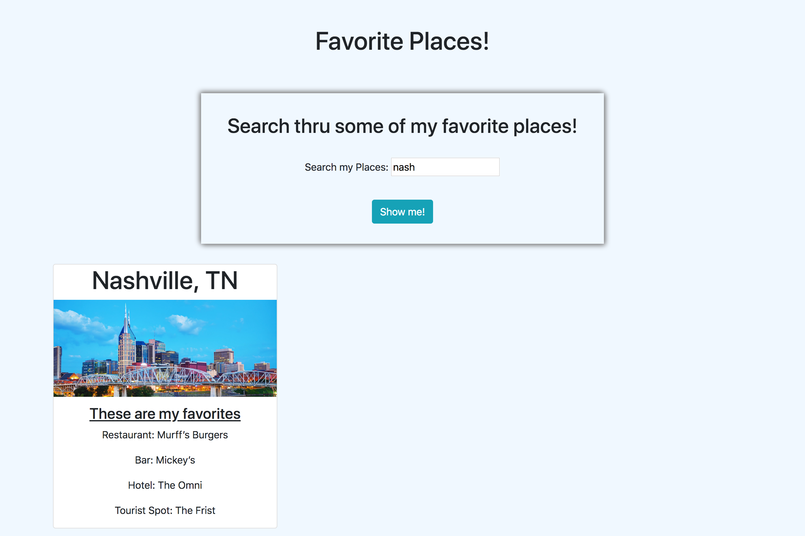

# Favorite Places

## Description
A simple website of a bunch of my favorite cities and some of my favorite places in those cities. You can search thru them with an input bar and it will search by city or state name.

## Screenshots
Here is page load:

Here is when searched "nash":

## Tech Used
* HTML
* CSS
* Javascript 
* Bootstrap
* JSON

## How To Run
1. Go to: `https://www.npmjs.com/package/http-server` and install "http-server".  
2. Navigate to the project folder in command line interface and type: `http-server -p 8080`  
3. This will show at: `http://localhost:8080` in your internet browser.

